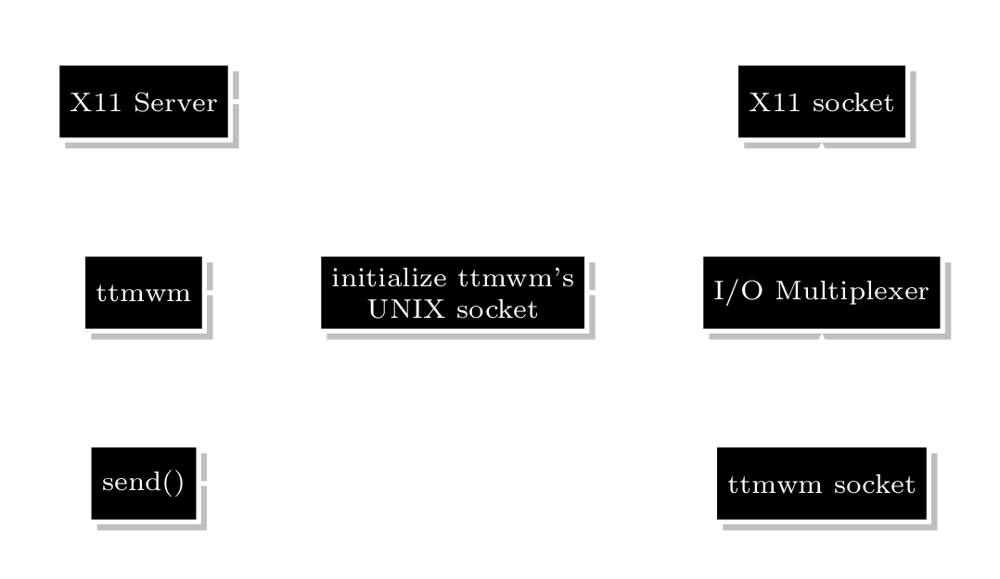

### Introduction

Window managers; many people use them to increase the efficiency of their workflows or to show how "cool" they are to their colleagues or friends. Window managers are among [bachelor's](https://www.cs.ru.nl/bachelors-theses/2019/Max_van_Deurzen___4581903___The_anatomy_of_the_modern_window_manager_-_a_case_study_for_X_in_an_Agile_manner.pdf) and even [master's](https://dspace.cvut.cz/bitstream/handle/10467/87816/F8-DP-2020-Bina-Jan-thesis.pdf?sequence=-1&isAllowed=y) thesis topics these days. As the title states, in my view, a minimalistic window manager that truly follows UNIX philosophy doesn't exist yet. Let me show you why and how by discussing current window managers and how the design of the true minimalistic window manager should be.

### DWM and BSPWM
I only want to discuss two existing window managers: [dwm](https://dwm.suckless.org/) and [bspwm](https://github.com/baskerville/bspwm), which I believe are the only ones worth discussing.

DWM, window manager (WM, for short) maintained by the [Suckless](https://suckless.org/philosophy/) community, which claims to be minimal, but miserably tries to accomplish tasks that are beyond the window manager program such as drawing a status bar or mapping keys which directly violates the [rule of composition](https://homepage.cs.uri.edu/~thenry/resources/unix_art/ch01s06.html#id2877684) and [rule of modularity](https://homepage.cs.uri.edu/~thenry/resources/unix_art/ch01s06.html#id2877537) of UNIX philosophy. Window manager, like any other program, should only provide output to other programs for other aspects of a complete desktop environment (e.g., status bar) while performing the task that the window manager program is only meant to perform; managing windows.

This design choice brings many ugly complexities like [dwmblocks]() or [slstatus]() programs that don't draw a status bar but only set the status text in the bar that DWM somehow felt responsible to draw. You need to hand-patch dwmblocks and the DWM's source code to make that ugly pile of code compatible with your already applied patches and at the same time you should try not the bang your head on walls for hours, **only to have a fully functional simple status bar**. This complexity could have been prevented if the whole bar would be a different X11 program that can communicate with the WM through UNIX sockets.

Suckless programs always try to comprise fewer lines of code (even in disfavor of **clarity** which violates [rule of clarity](https://homepage.cs.uri.edu/~thenry/resources/unix_art/ch01s06.html#id2877610)) and expect you to hand-hack source code by creating patches or applying existing patches created by the community at the different versions of the DWM while the source code barely includes any comments for hackers. I like the idea that "everyone should get what they actually need", although the way the Suckless community tries to handle it makes DWM the most time-consuming WM to maintain so far. There are many ways to create modular software that allows people to get what they actually need while building the software (e.g., Linux Kernel), although they picked the most complex, chaotic, and time-consuming one for a community that aims to create "minimalistic" programs.

There's a project [dwm-flexipatch](https://github.com/bakkeby/dwm-flexipatch) that houses almost all the patches created by the community and uses preprocessor directives for applying patches without a headache and even this doesn't make me forgive other sins this WM and the Suckless community committed so far in the name of simplicity.

On the other hand, BSPWM's design is modular and doesn't involve key-mapping, handling pointer inputs, and drawing a status bar. I predict that BSPWM's architecture should be pretty similar to our imaginary (yet) TTMWM's architecture as can be seen in the diagram below.

BSPWM still falls short for me. It isn't as expandable as DWM and is too specific (its binary layout, for example). That's why, despite my dislike for it, I've been using DWM for years. However, this whole writing made me work on my own window manager, TTMWM.
